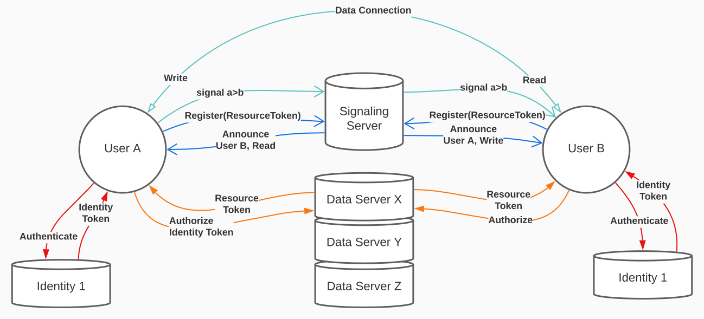

# Авторизация и аутентификация

## Аутентификация

* Производится у сторонних провайдеров, поддерживающих WebID-OIDC
* Юзер получает IdToken для ДатаСервера у провайдера и использует его для запросов на сервере

## Авторизация

* Произовдится на датасервере
* Юзер отправляет свой IdToken и/или ResourceToken родительского ресурса
* Сервер проверяет доступ по DAC/IBAC и возвращает ResourceToken

## Установка WebRTC соединения

* Юзер A регистрируется в комнате сигнального сервиса по ResourceToken
* Сигнальный сервер проверяет ResourceToken и публикует информацию (UserId, AccessMode, Expiration)
* Юзер Б видит эту информацию, создает WebRTC offer. Отправляет его юзеру А через сигнальный сервер.
* Юзер А получает оффер и информацию об юзере Б, и отправляет ему WebRTC answer.
* Юзеры А и Б знают о правах собеседника и учитывают это, например, не принимают обновления документа от пользователей с правами на чтение

